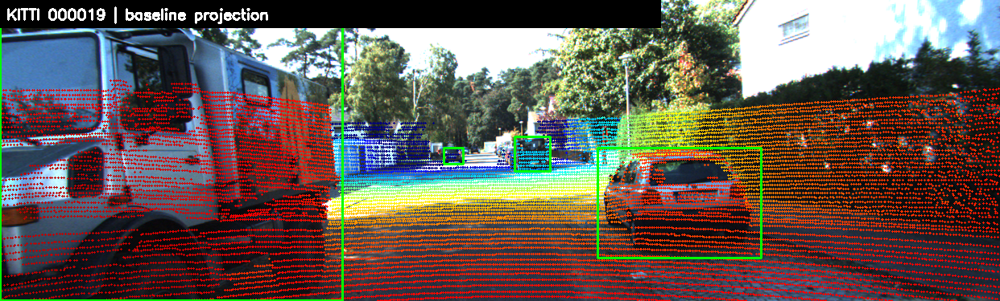
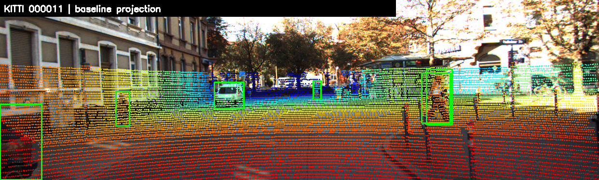
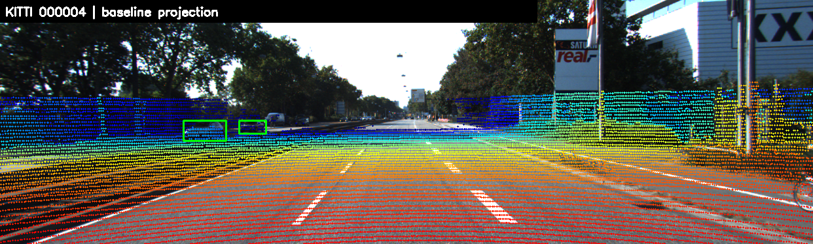
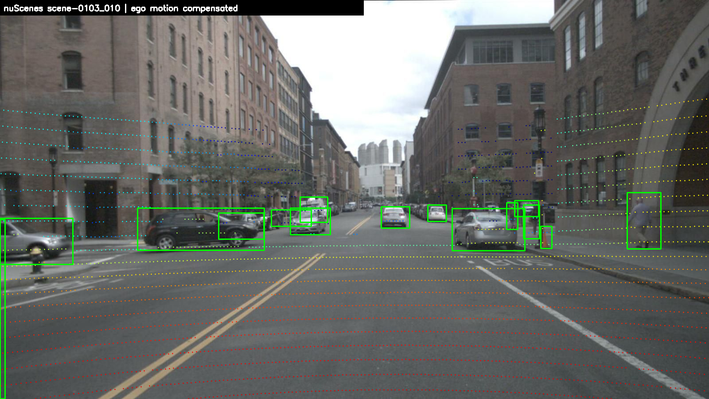
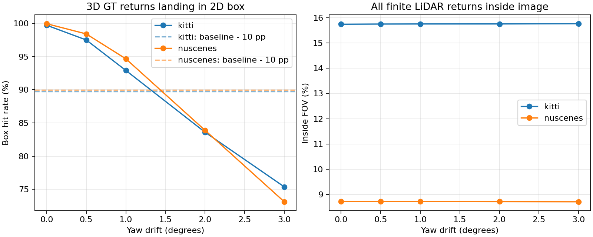
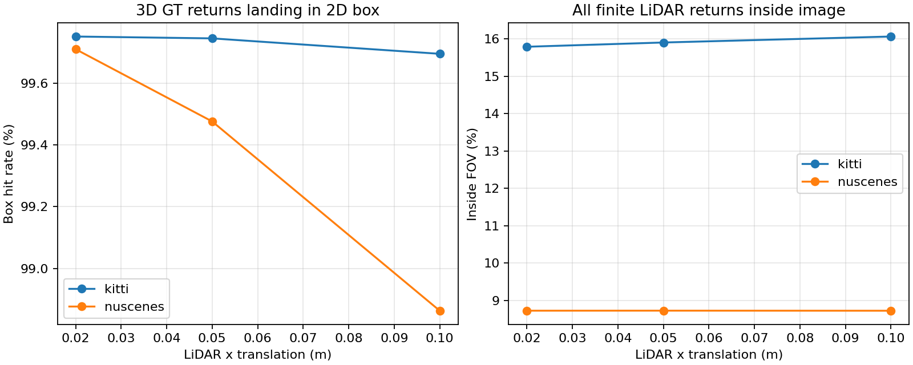
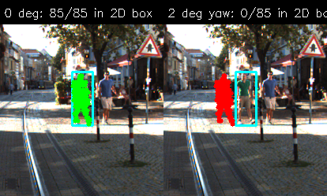

# Báo cáo Day 6: Kiểm tra calibration LiDAR–camera bằng phép chiếu

- **Họ tên:** Hoàng Trung Khải
- **MSSV:** 2A202602947
- **Lớp:** VinUni AI20K — Track 4
- **Link repo:** https://github.com/khaihoang004/HoangTrungKhai-2A202602947-Track4-Day21
- **Topic:** A — LiDAR-camera projection QA
- **Dataset:** `data/synthetic`, `data/kitti_mini`, `data/nuscenes_mini_subset`
- **Các frame đã dùng:** Toàn bộ 20 ID trong `data/kitti_mini/training/velodyne/`; `scene-0103_000`–`scene-0103_039` và `scene-1094_000`–`scene-1094_039`. Ảnh minh hoạ: KITTI `000019`, `000011`, `000004`, `000043`; nuScenes `scene-0103_010`.

## 1. Claim

Trên hai tập dữ liệu thật đã cho, lệch **yaw LiDAR 2°** làm tỉ lệ điểm thuộc box 3D của vật thể còn rơi trong box 2D giảm **hơn 15 điểm phần trăm**, nhưng tỉ lệ tất cả điểm LiDAR nằm trong ảnh thay đổi **dưới 0,02 điểm phần trăm**. Vì vậy chỉ dùng số điểm trong FOV để kiểm tra calibration có thể bỏ sót lệch yaw lớn.

## 2. Evidence

Mỗi lần chạy chỉ đổi **yaw** hoặc **dịch LiDAR theo trục x**; frame, ảnh, nhãn, lọc depth và thuật toán đều giữ nguyên. Từ GT box 3D trong camera frame, lấy các điểm LiDAR nằm trong box, nhìn thấy trong ảnh ở cấu hình gốc, có depth 5–60 m; bỏ object có dưới 5 điểm. `box hit` = số điểm đó chiếu vào box 2D GT / tổng điểm đủ điều kiện, gộp theo số điểm trên mọi frame; đây là **chỉ số proxy**, không phải AP hay độ đúng calibration tuyệt đối. `FOV` = số điểm hữu hạn chiếu vào ảnh / mọi điểm XYZ hữu hạn. nuScenes sử dụng bù ego motion mặc định.

| Dữ liệu | Yaw | Box hit | FOV | Dịch chuyển pixel trung vị* |
|---|---:|---:|---:|---:|
| KITTI (20 frame, 32.182 điểm object) | 0° | 99,717% | 15,740% | 0,000 |
| KITTI | 0,5° | 97,499% | 15,747% | 7,298 |
| KITTI | 1° | 92,906% | 15,750% | 14,579 |
| KITTI | **2°** | **83,600%** | **15,751%** | 29,095 |
| KITTI | 3° | 75,374% | 15,760% | 43,516 |
| nuScenes (80 frame, 17.948 điểm object) | 0° | 99,944% | 8,727% | 0,000 |
| nuScenes | 0,5° | 98,407% | 8,723% | 12,602 |
| nuScenes | 1° | 94,662% | 8,723% | 25,167 |
| nuScenes | **2°** | **83,887%** | **8,718%** | 50,196 |
| nuScenes | 3° | 73,128% | 8,712% | 75,194 |

*Trung vị của các trung vị theo frame, tính trên cùng các điểm nằm trong ảnh ở cả baseline và cấu hình lệch, depth gốc 5–60 m. Số liệu gốc: [`calibration_sweep.csv`](../results/calibration_sweep.csv); bảng từng frame: [`calibration_by_frame.csv`](../results/calibration_by_frame.csv); bảng từng object: [`calibration_by_object.csv`](../results/calibration_by_object.csv).

Lệch dịch x **2/5/10 cm** cho box hit lần lượt **99,751/99,745/99,695%** trên KITTI và **99,710/99,476/98,863%** trên nuScenes (cùng CSV). Trên tập này, yaw ảnh hưởng box hit rõ hơn dịch x; phép so sánh chỉ áp dụng cho khoảng dịch và hướng đã thử. KITTI và nuScenes có độ phân giải ảnh, calibration, mật độ LiDAR (64/32 beam), scene và thời điểm chụp khác nhau, nên độ dịch pixel khác nhau **không quy riêng cho số beam**.








Nguồn ảnh: KITTI Vision Benchmark Suite; nuScenes (Motional). Để tự kiểm, điểm LiDAR `(10, 0, 0)` với calibration synthetic `000000` cho `z_cam = 9,727 m`, pixel xấp xỉ `(613,964; 175,007)`.

## 3. Failure case



KITTI `000043`, người đi bộ object 2 ở khoảng **20,443 m**: baseline có **85/85** điểm LiDAR của box 3D rơi vào box 2D; sau khi cố tình làm lệch yaw 2°, chỉ còn **0/85**. Ảnh đặt cạnh cùng một vùng ảnh và cùng các điểm: xanh lá là baseline, đỏ là lệch yaw; khung cyan là box 2D GT. Lỗi gốc thuộc lớp **Geometry** (extrinsic bị xoay); việc FOV toàn dataset gần như không báo động là lỗi lựa chọn **Metric**, vì điểm vẫn nằm trong ảnh dù không còn nằm trên vật thể. Khi vận hành, cần so khớp với biên ảnh/nhãn tin cậy theo vùng và theo khoảng cách, thay vì chỉ đếm điểm FOV. Điểm trong box 3D và 2D GT là proxy phụ thuộc chất lượng label và sự che khuất; không thể dùng trực tiếp điểm số này nếu xe chạy thật không có GT.

## 4. Khuyến nghị nếu triển khai thật

Với ADAS hợp nhất LiDAR–camera, kiểm tra sau va chạm hoặc thay bracket bằng overlay và điểm alignment theo vật thể ở nhiều khoảng cách. Trong log, ghi phân bố số điểm hợp lệ/FOV, độ lệch biên ảnh với depth edge, cảnh báo theo vùng ảnh và độ ổn định qua thời gian, cùng chênh timestamp LiDAR–camera. Ngưỡng thử nghiệm **giảm box hit 10 điểm phần trăm** so với baseline sẽ bắt được yaw 2° trong cả hai tập, nhưng chưa bắt 1°; ngưỡng này cần hiệu chuẩn bằng dữ liệu riêng và đánh giá false alarm trước khi dùng tự động. Kiểm tra chi tiết tăng chi phí tính toán/độ trễ; có thể chạy kiểm tra nhanh mỗi frame và kiểm tra nhiều vùng ở tần suất thấp hơn, đồng thời chuyển hệ thống sang chế độ an toàn khi phát hiện lệch lớn.

## 5. Cách chạy lại

Từ thư mục gốc repo, dùng Python 3.10+ (các lệnh dưới đây dùng `python3`; có thể dùng `python` nếu môi trường đã ánh xạ tên đó):

```bash
python3 -m venv .venv
source .venv/bin/activate
python3 -m pip install -r requirements.txt
python3 tools/verify_data.py --data-root data/kitti_mini
python3 tools/verify_data.py --data-root data/nuscenes_mini_subset
python3 -m starter.data_health --data-root data/synthetic --out results/data_health.csv
python3 -m starter.projection --data-root data/synthetic --frame 000000
python3 -m starter.projection --data-root data/kitti_mini --frame 000011
python3 -m starter.projection --data-root data/nuscenes_mini_subset --frame scene-0103_010
python3 -m src.calibration_qa --datasets kitti nuscenes --out-dir results
python3 tools/check_submission.py
```

Script [`src/calibration_qa.py`](../src/calibration_qa.py) có `--help`, nhận `--datasets` và `--out-dir`. Không có phép lấy mẫu ngẫu nhiên nên không cần seed; khi chạy lại trên đúng dữ liệu và thư viện tương thích, các số đếm và tỉ lệ sẽ giữ nguyên. Script tự chọn ảnh failure là người đi bộ KITTI có mức giảm box hit lớn nhất tại 2°, trong nhóm có ít nhất 50 điểm và depth 10–35 m.

## 6. Khai báo sử dụng AI

Ghi rõ đã dùng công cụ AI nào, dùng vào việc gì, và bạn đã tự kiểm chứng kết quả đó bằng cách nào. Nếu không dùng AI, ghi "Không sử dụng". Xem quy định ở `RULES.md` mục 2.

| Công cụ | Dùng cho việc gì | Bạn đã kiểm chứng thế nào |
|---|---|---|
| OpenAI Codex | Viết hai hàm projection, script thí nghiệm, đồ thị, ảnh minh hoạ | Chạy lệnh trên dữ liệu trong repo; kiểm tra điểm synthetic `(10,0,0)`, đối chiếu CSV với bảng và xem trực tiếp overlay/failure; chạy `check_submission.py`. |
